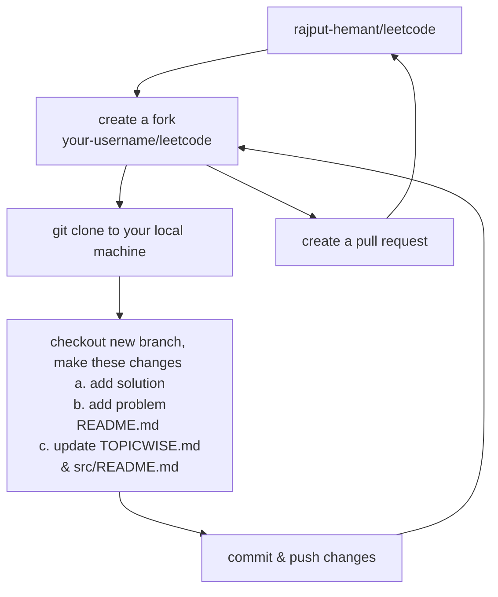

<!-- labels -->

[![][code-quality]][codacy] [![][active-issues]][deepsource] [![][resolved-issues]][deepsource]

![][views] ![][stars] ![][forks] ![][issues] ![][license] ![][code-size] ![][commit-activity]

<!-- title/logo -->

<picture>
  <source media="(prefers-color-scheme: light)" srcset="https://telegra.ph/file/50295ab5d953128d8e698.png">
  <source media="(prefers-color-scheme: dark)" srcset="https://telegra.ph/file/7ea4a5e6d225c0fe19686.png">
  
</picture>

### 🏆 Curated solutions to Leetcode problems in multiple languages to ace the Coding Interviews.

## Solutions

---

[<kbd>   **Topic Wise**   </kbd>][topicwise] &nbsp;&nbsp;
[<kbd>   **Serial Wise**   </kbd>][serialwise]

---

## Contributions

- Fork [this repository][leetcode] to your own GitHub account and then clone it to your local machine.
- Checkout a new branch.
- Make some changes to your leetcode repository, then push the changes to your remote GitHub repository.
- Create a pull request with your changes!
- See [CONTRIBUTING](./CONTRIBUTING.md) or [GitHub Help](https://help.github.com/en) for more details.

## Contributors

[![][contributors]][contributors-graph]

### Show Some ❤️ by giving ⭐ to the Repository

<!----------------------------------{ Images }--------------------------------->

[contributors]: https://contrib.rocks/image?repo=rajput-hemant/leetcode&max=500
[contributors-graph]: https://github.com/rajput-hemant/leetcode/graphs/contributors

<!--------------------------------{ DeepSource }------------------------------->

[deepsource]: https://deepsource.io/gh/rajput-hemant/leetcode/?ref=repository-badge
[active-issues]: https://deepsource.io/gh/rajput-hemant/leetcode.svg/?label=active+issues&showtrend=true&token=IPVIQX-cSuQSVeVl8cb5PLt
[resolved-issues]: https://deepsource.io/gh/rajput-hemant/leetcode.svg/?label=resolved+issues&showtrend=true&token=IPVIQX-cSuQSVeVl8cb5PLt

<!----------------------------------{ Codacy }--------------------------------->

[codacy]: https://www.codacy.com/gh/rajput-hemant/leetcode/dashboard?utmsource=github.com&utmmedium=referral&utmcontent=rajput-hemant/leetcode&utmcampaign=BadgeGrade
[code-quality]: https://app.codacy.com/project/badge/Grade/97e3ea868f9344a5aa6e4d874f83db14

<!----------------------------------{ Labels }--------------------------------->

[views]: https://komarev.com/ghpvc/?username=leetcode&label=view%20counter&color=red&style=flat
[code-size]: https://img.shields.io/github/languages/code-size/rajput-hemant/leetcode
[issues]: https://img.shields.io/github/issues-raw/rajput-hemant/leetcode
[license]: https://img.shields.io/github/license/rajput-hemant/leetcode
[commit-activity]: https://img.shields.io/github/commit-activity/w/rajput-hemant/leetcode
[forks]: https://img.shields.io/github/forks/rajput-hemant/leetcode?style=flat
[stars]: https://img.shields.io/github/stars/rajput-hemant/leetcode

<!-----------------------------------{ Mics }---------------------------------->

[leetcode]: https://github.com/rajput-hemant/leetcode
[topicwise]: ./TOPICWISE.md
[serialwise]: ./src/README.md
